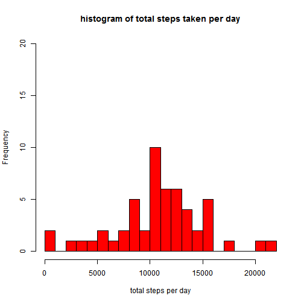
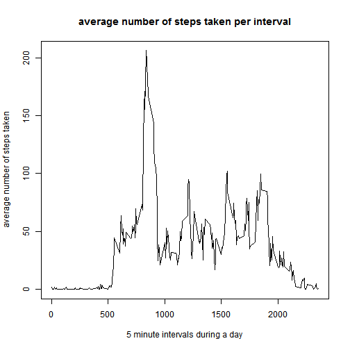
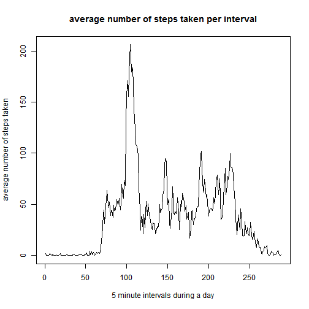
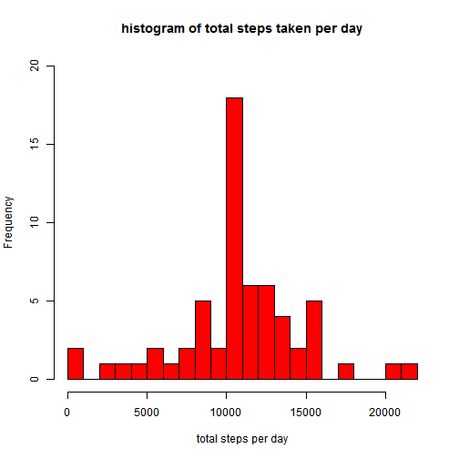
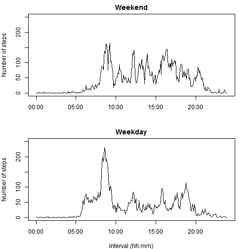

This is an R Markdown document. 

**Loading and preprocessing the data**

```r
##download and unzip data to local directory
fileUrl<-"https://d396qusza40orc.cloudfront.net/repdata%2Fdata%2Factivity.zip"
download.file(fileUrl,destfile = "./repdata-data-activity.zip")
mydata <- read.csv(unz("./repdata-data-activity.zip", "activity.csv"))
##set option so R displays results correctly 
options(digits=10)
##summary of data and noticing of NAs
summary(mydata)
```

```
##      steps                  date          interval      
##  Min.   :  0.0000   2012-10-01:  288   Min.   :   0.00  
##  1st Qu.:  0.0000   2012-10-02:  288   1st Qu.: 588.75  
##  Median :  0.0000   2012-10-03:  288   Median :1177.50  
##  Mean   : 37.3826   2012-10-04:  288   Mean   :1177.50  
##  3rd Qu.: 12.0000   2012-10-05:  288   3rd Qu.:1766.25  
##  Max.   :806.0000   2012-10-06:  288   Max.   :2355.00  
##  NA's   :2304       (Other)   :15840
```

```r
##remove NAs from data
cleandata<-mydata[complete.cases(mydata),]
##summary of cleaned data
summary(cleandata)
```

```
##      steps                  date          interval      
##  Min.   :  0.0000   2012-10-02:  288   Min.   :   0.00  
##  1st Qu.:  0.0000   2012-10-03:  288   1st Qu.: 588.75  
##  Median :  0.0000   2012-10-04:  288   Median :1177.50  
##  Mean   : 37.3826   2012-10-05:  288   Mean   :1177.50  
##  3rd Qu.: 12.0000   2012-10-06:  288   3rd Qu.:1766.25  
##  Max.   :806.0000   2012-10-07:  288   Max.   :2355.00  
##                     (Other)   :13536
```
*Here we download the zipped data file and assign it as mydata.  Then we remove the rows with missing values from the data frame and assign it as cleandata.  From the summary we can see mydata and cleandata have different sizes.*

**What is mean total number of steps taken per day?**

```r
t<-aggregate(steps~date,cleandata,sum)
summary(t)
```

```
##          date        steps         
##  2012-10-02: 1   Min.   :   41.00  
##  2012-10-03: 1   1st Qu.: 8841.00  
##  2012-10-04: 1   Median :10765.00  
##  2012-10-05: 1   Mean   :10766.19  
##  2012-10-06: 1   3rd Qu.:13294.00  
##  2012-10-07: 1   Max.   :21194.00  
##  (Other)   :47
```

```r
hist(t$steps,col="red",breaks=20,ylim=c(0,20),xlab="total steps per day",main="histogram of total steps taken per day")
```

 

```r
print(paste("the mean of number of total steps taken each day is ",mean(t$steps),sep=""))
```

```
## [1] "the mean of number of total steps taken each day is 10766.1886792453"
```

```r
print(paste("the median of number of total steps taken each day is ",median(t$steps),sep=""))
```

```
## [1] "the median of number of total steps taken each day is 10765"
```
*We plot the histogram of total steps taken per day.  Here we fix the scale of y-axis to allow comparison with a similar plot below.  The mean and median of total steps per day are 10766.19 and 10765 respectively.*

**What is the average daily activity pattern?**

```r
##calculate average steps taken per specific time interval
s<-aggregate(steps~interval,cleandata,mean)
summary(s)
```

```
##     interval           steps           
##  Min.   :   0.00   Min.   :  0.000000  
##  1st Qu.: 588.75   1st Qu.:  2.485849  
##  Median :1177.50   Median : 34.113208  
##  Mean   :1177.50   Mean   : 37.382600  
##  3rd Qu.:1766.25   3rd Qu.: 52.834906  
##  Max.   :2355.00   Max.   :206.169811
```

```r
##plot average steps vs. intervals
plot(s$interval,s$steps,type="l",xlab = "5 minute intervals during a day",ylab = "average number of steps taken",main="average number of steps taken per interval")
```

 

**WARNING:the %H%M time format of variable "interval" has introduced distortion in the plot**

```r
##The value of intervals can not be used directly! Otherwise it will introduce visual distortion (Because interval is a %H%M time format,so missing values between xx60 to xx95)
plot(s$steps,type="l",xlab = "5 minute intervals during a day",ylab = "average number of steps taken",main="average number of steps taken per interval")
```

 

```r
#find out the interval which has the max average number of steps
maxs=s[which.max(s$steps),1]
maxs=formatC(maxs,width=4,flag=0)
m1=substr(maxs,0,2)
m2=substr(maxs,3,4)
print(paste("the 5 minute interval starting from ",m1,":",m2," on average contains the maximum number of steps",sep=""))
```

```
## [1] "the 5 minute interval starting from 08:35 on average contains the maximum number of steps"
```
*We plot the number of steps taken at specific time interval averaged across all day.  Notice the first plot introduces distortion as there are gaps in the time interval series between xx60 and xx95 (including both).  This causes the plotted lines over these gaps to be stretched out.  The second plot eliminates this effect.  From the plot we can see there are minimum activities during the night hours, and the peak of activity happens around 8:35 to 8:40 in the morning (possiblly period of exercise).*

**Imputing missing values**

```r
##the number of missing observations
y<-is.na(mydata$steps)
print(paste("the number of missing value is",sum(y)))
```

```
## [1] "the number of missing value is 2304"
```

```r
##we will use average of steps taken per specific time interval for missing values
##first add a column of average steps taken
tempdata<-mydata
tempdata$avgsteps<-rep(s$steps,length(unique(tempdata$date)))  ##s is the set of average steps taken per specific time interval from above
##next substitute NA values with the corresponding average steps value
tempdata$steps[is.na(tempdata$steps)]<-0
tempdata$newsteps<-tempdata$steps + y*tempdata$avgsteps
newdata=data.frame(steps=tempdata$newsteps,date=tempdata$date,interval=tempdata$interval)

z<-aggregate(steps~date,newdata,sum)
summary(z)
```

```
##          date        steps         
##  2012-10-01: 1   Min.   :   41.00  
##  2012-10-02: 1   1st Qu.: 9819.00  
##  2012-10-03: 1   Median :10766.19  
##  2012-10-04: 1   Mean   :10766.19  
##  2012-10-05: 1   3rd Qu.:12811.00  
##  2012-10-06: 1   Max.   :21194.00  
##  (Other)   :55
```

```r
hist(z$steps,col="red",breaks=20,ylim=c(0,20),xlab="total steps per day",main="histogram of total steps taken per day")
```

 

```r
print(paste("the mean of number of total steps taken each day is ",mean(z$steps),sep=""))
```

```
## [1] "the mean of number of total steps taken each day is 10766.1886792453"
```

```r
print(paste("the median of number of total steps taken each day is ",median(z$steps),sep=""))
```

```
## [1] "the median of number of total steps taken each day is 10766.1886792453"
```
*We replace the missing values in the steps column with the means of steps taken for that specific 5-minute interval.  This is based upon the assumption that the subject has the same daily routine in the missing days, rather than being bed bound because of illness for example.  Comparing the resulting histogram with the one before, we see that the frequecy of values around mean has risen sharply.  This is because the total steps taken in the missing days now equals to the mean of total steps taken per day across all days.  The end result is the mean and medium of total steps per day are the same (mathmatically provable), both at 10766*

**Are there differences in activity patterns between weekdays and weekends?**

```r
##keep using the filled in dataset
nd<-newdata
##Create a new factor variable wkday with two levels "weekday" and "weekend"
nd$wkday<-factor((weekdays(as.Date(nd$date)) %in% c('Monday','Tuesday','Wednesday','Thursday','Friday')),levels=c(TRUE,FALSE),labels=c('weekday','weekend'))
##use lattice plot for average steps taken on both weekdays and weekends
nd2<-aggregate(steps~interval+wkday,nd,mean)
library(lattice)
xyplot(steps~interval|wkday,nd2,type="l",layout=c(1,2),ylab="Number of steps")
```

 

**Again use different plots to eliminate the distortion from gaps in time series**


```r
##again the x axis is distorted, so we correct it.  (can not figure out how to use xyplot for this so we use base plot)
nd2$interval <- strptime(sprintf("%04d", nd2$interval), format="%H%M")
par(mfrow=c(2,1),mar=c(4,4,2,2))
with(nd2[nd2$wkday=="weekend",],plot(interval,steps,type="l", ylim=c(0,250),xlab="",ylab="Number of steps",main="Weekend"))
with(nd2[nd2$wkday=="weekday",],plot(interval,steps,type="l", ylim=c(0,250),xlab="Interval (hh:mm)", ylab="Number of steps",main="Weekday"))
```

 

*We see the activity pattern of weekend days are clearly different from that of weekdays.  There are much less early morning activities on weekend (sleeping late?), a much lower activity peak (less exercise?), and generally more activities during the rest of the day (weekend fun?)*
